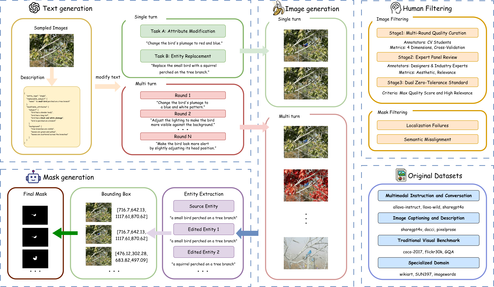
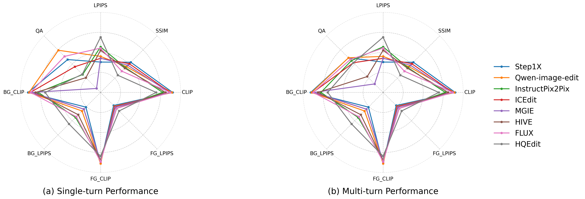
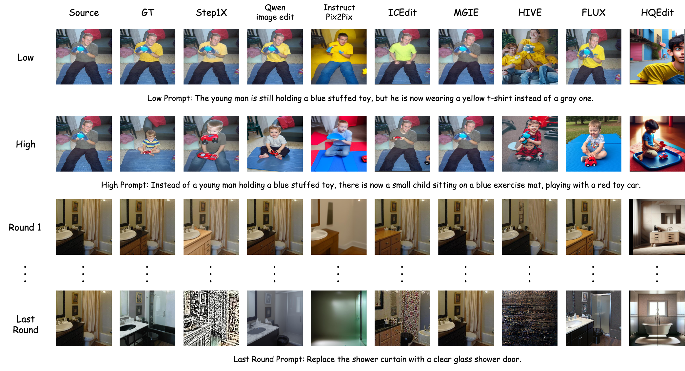

<div align="center">

# Omni IIE Bench

### Benchmarking the Practical Capabilities of Instruction-based Image Editing Models

[[arXiv](https://arxiv.org/abs/2603.16944)] [[HuggingFace Dataset](https://huggingface.co/datasets)] [[Project Page](https://github.com/Young-2000/OmniIIEBench)]

</div>

---

## Overview

**Omni IIE Bench** is a human-annotated benchmark for diagnosing **editing consistency** of Instruction-based Image Editing (IIE) models. Unlike existing benchmarks that use mixed evaluations, Omni IIE Bench employs a **dual-track diagnostic design** with a **16-turn dialogue length** — the longest among all IIE benchmarks.

<p align="center">
  
</p>

### Key Highlights

- **Rigorous dual-track design**: Single-turn Consistency (shared-context task pairs) + Multi-turn Coordination (continuous dialogue spanning semantic scales)
- **12 diverse data sources** across 4 categories (multimodal instruction, captioning, traditional benchmarks, specialized domains)
- **Strict human curation**: Only **35.94%** of single-turn and **37.36%** of multi-turn candidates survived dual zero-tolerance filtering
- **8 mainstream IIE models** evaluated; all exhibit significant performance degradation from low- to high-semantic-scale tasks
- **Strong human alignment**: All automated metric rankings correlate with human rankings at **r > 0.85**

---

## Benchmark Comparison

Omni IIE Bench stands out across all key diagnostic dimensions:

| Benchmark | Human Verified | Provides Mask | Practical Scenarios | Semantic Scale | Dialogue Length |
|:---|:---:|:---:|:---:|:---:|:---:|
| I2EBench | ✅ | ✅ | ❌ | ✅ | 1 |
| EditBench | ✅ | ✅ | ❌ | ✅ | 1 |
| EditVal | ✅ | ❌ | ❌ | ❌ | 1 |
| EmuEdit | ✅ | ❌ | ❌ | ❌ | 1 |
| AnyEdit | ❌ | ✅ | ❌ | ❌ | 1 |
| CompBench | ✅ | ✅ | ❌ | ❌ | 2 |
| MagicBrush | ✅ | ❌ | ❌ | ❌ | 3 |
| ImgEdit-Bench | ✅ | ❌ | ❌ | ❌ | 3 |
| MuCIE | ❌ | ❌ | ❌ | ❌ | 5 |
| **Omni IIE Bench** | **✅** | **✅** | **✅** | **✅** | **16** |

---

## Main Results

### Single-Turn Consistency

Overall score: `(1/4)[(3-ΣLPIPS)/3 + ΣCLIP/3 + QA + SSIM]`

| Model | LPIPS (↓) FG | LPIPS (↓) BG | LPIPS (↓) ALL | CLIP (↑) FG | CLIP (↑) BG | CLIP (↑) ALL | QA (↑) | PSNR (↑) | SSIM (↑) | Overall |
| --- | --- | --- | --- | --- | --- | --- | --- | --- | --- | --- |
| Qwen-image-edit | 0.245 | 0.327 | 0.450 | **0.887** | 0.891 | 0.889 | **0.744** | 14.401 | 0.455 | **0.687** |
| InstructPix2Pix | 0.284 | 0.441 | 0.569 | 0.774 | 0.775 | 0.841 | 0.316 | 12.423 | 0.438 | 0.530 |
| ICEdit | 0.252 | 0.295 | 0.425 | 0.867 | 0.875 | 0.868 | 0.453 | 15.541 | 0.507 | 0.626 |
| MGIE | 0.261 | 0.294 | 0.426 | 0.858 | 0.864 | 0.859 | 0.070 | 14.733 | 0.480 | 0.520 |
| HIVE | 0.287 | 0.406 | 0.526 | 0.849 | 0.796 | 0.794 | 0.259 | 13.423 | 0.414 | 0.527 |
| FLUX | 0.283 | 0.428 | 0.552 | 0.863 | 0.871 | 0.868 | 0.636 | 12.553 | 0.375 | 0.614 |
| HQEdit | 0.327 | 0.557 | 0.689 | 0.794 | 0.691 | 0.694 | 0.322 | 9.259 | 0.304 | 0.457 |
| Step1X | **0.230** | **0.259** | **0.379** | **0.887** | **0.903** | **0.899** | 0.580 | **15.845** | **0.533** | 0.680 |

### Multi-Turn Coordination

| Model | LPIPS (↓) FG | LPIPS (↓) BG | LPIPS (↓) ALL | CLIP (↑) FG | CLIP (↑) BG | CLIP (↑) ALL | QA (↑) | PSNR (↑) | SSIM (↑) | Overall |
| --- | --- | --- | --- | --- | --- | --- | --- | --- | --- | --- |
| Qwen-image-edit | 0.254 | 0.390 | 0.510 | 0.888 | 0.879 | 0.877 | **0.818** | 13.521 | 0.391 | **0.676** |
| InstructPix2Pix | 0.296 | 0.552 | 0.669 | 0.842 | 0.701 | 0.703 | 0.560 | 10.910 | 0.393 | 0.549 |
| ICEdit | 0.263 | 0.388 | 0.515 | 0.875 | 0.845 | 0.842 | 0.524 | 14.537 | 0.435 | 0.606 |
| MGIE | 0.325 | 0.580 | 0.685 | 0.801 | 0.710 | 0.723 | 0.054 | 10.508 | 0.350 | 0.404 |
| HIVE | 0.294 | 0.484 | 0.607 | 0.847 | 0.771 | 0.770 | 0.487 | 12.415 | 0.337 | 0.540 |
| FLUX | 0.275 | 0.478 | 0.599 | 0.867 | 0.860 | 0.857 | 0.678 | 11.903 | 0.332 | 0.605 |
| HQEdit | 0.317 | 0.590 | 0.710 | 0.819 | 0.677 | 0.682 | 0.524 | 9.010 | 0.292 | 0.501 |
| Step1X | **0.250** | **0.344** | **0.453** | **0.896** | **0.888** | **0.885** | 0.610 | **14.837** | **0.464** | 0.654 |

> **Key finding**: All models suffer significant performance degradation in multi-turn settings due to error accumulation, especially in background preservation.

---

## Semantic Scale Analysis

A unique feature of Omni IIE Bench is the **semantic scale** dimension. Nearly all models degrade when transitioning from low-semantic to high-semantic tasks:

<p align="center">
  
</p>

### Low Semantic Scale (Single-Turn)


| Model | LPIPS (↓) FG | LPIPS (↓) BG | LPIPS (↓) ALL | CLIP (↑) FG | CLIP (↑) BG | CLIP (↑) ALL | QA (↑) | PSNR (↑) | SSIM (↑) | Overall |
| --- | --- | --- | --- | --- | --- | --- | --- | --- | --- | --- |
| Qwen-image-edit | 0.231 | 0.299 | 0.414 | 0.910 | 0.899 | 0.910 | **0.780** | 15.323 | 0.474 | 0.710 |
| Instruct_Pix2Pix | 0.284 | 0.435 | 0.555 | 0.861 | 0.797 | 0.796 | 0.400 | 12.476 | 0.443 | 0.559 |
| ICEdit | 0.250 | 0.311 | 0.407 | 0.888 | 0.896 | 0.889 | 0.550 | 16.107 | 0.519 | 0.662 |
| MGIE | 0.264 | 0.294 | 0.406 | 0.894 | 0.898 | 0.895 | 0.080 | 15.328 | 0.495 | 0.539 |
| HIVE | 0.283 | 0.376 | 0.505 | 0.873 | 0.836 | 0.836 | 0.300 | 14.257 | 0.444 | 0.551 |
| FLUX | 0.287 | 0.422 | 0.545 | 0.878 | 0.891 | 0.888 | 0.720 | 12.769 | 0.376 | 0.641 |
| HQEdit | 0.314 | 0.539 | 0.671 | 0.810 | 0.711 | 0.713 | 0.420 | 9.504 | 0.314 | 0.491 |
| Step1X | **0.218** | **0.244** | **0.353** | **0.912** | **0.923** | **0.920** | 0.650 | **16.663** | **0.547** | **0.711** |

### High Semantic Scale (Single-Turn)

| Model | LPIPS (↓) FG | LPIPS (↓) BG | LPIPS (↓) ALL | CLIP (↑) FG | CLIP (↑) BG | CLIP (↑) ALL | QA (↑) | PSNR (↑) | SSIM (↑) | Overall |
| --- | --- | --- | --- | --- | --- | --- | --- | --- | --- | --- |
| Qwen-image-edit | 0.264 | 0.360 | 0.495 | **0.859** | 0.866 | 0.866 | **0.710** | 13.241 | 0.431 | **0.657** |
| Instruct_Pix2Pix | 0.283 | 0.448 | 0.586 | 0.816 | 0.749 | 0.747 | 0.230 | 12.356 | 0.431 | 0.498 |
| ICEdit | 0.254 | 0.311 | 0.448 | 0.840 | 0.849 | 0.842 | 0.360 | **14.830** | 0.492 | 0.589 |
| MGIE | 0.264 | 0.313 | 0.452 | 0.813 | 0.821 | 0.813 | 0.060 | 13.983 | 0.461 | 0.499 |
| HIVE | 0.278 | 0.415 | 0.552 | 0.819 | 0.783 | 0.778 | 0.220 | 13.122 | 0.407 | 0.501 |
| FLUX | 0.277 | 0.436 | 0.562 | 0.844 | 0.848 | 0.844 | 0.550 | 12.282 | 0.373 | 0.586 |
| HQEdit | 0.316 | 0.578 | 0.711 | 0.774 | 0.668 | 0.670 | 0.220 | 8.952 | 0.291 | 0.420 |
| Step1X | **0.247** | **0.278** | **0.411** | 0.857 | **0.878** | **0.872** | 0.510 | 14.818 | **0.515** | 0.646 |

---

## Visual Comparison

<p align="center">
  
</p>

---

## Dataset Statistics

### Data Sources

Omni IIE Bench draws from **12 diverse datasets** across 4 categories:

| Category | Datasets |
|:---|:---|
| Multimodal Instruction & Conversation | allava-instruct, llava-wild, sharegpt4o |
| Image Captioning & Description | sharegpt4v, docci, pixelprose |
| Traditional Visual Benchmark | coco2017val, flickr30k, GQA |
| Specialized Domain | wikiart, SUN397, imageinwords |

### Curation Statistics

| Metric | Single-Turn | Multi-Turn |
|:---|:---:|:---:|
| Initial candidates | 4,800 samples | 696 groups (5,421 images) |
| After quality review | 50.86% passed | — |
| After industry review | 29.33% discarded | — |
| **Final acceptance rate** | **35.94%** | **37.36%** (groups) / **20.86%** (images) |
| **Final count** | **1,725 samples** | **260 groups / 1,131 images** |

### Multi-Turn Attributes

| Attribute | Value |
|:---|:---:|
| Dialogue groups | 260 |
| Average depth | 4.35 turns |
| Total editing turns | 1,131 |
| Attribute → Entity scale switches | 322 |
| Entity → Attribute scale switches | 178 |

---

## Installation

```bash
git clone https://github.com/Young-2000/OmniIIEBench.git
cd OmniIIEBench
pip install -r requirements.txt
```

---

## Repository Structure

```
iie_bench/
├── evaluation/
│   ├── evaluate.py           # Main evaluation script (LPIPS, PSNR, SSIM, CLIP-I, FG/BG)
│   ├── metrics_utils.py      # Metric implementations
│   └── run_evaluation.sh     # Batch multi-turn evaluation
│
└── dataset_construction/
    ├── MLLM_description.py       # MLLM image description
    ├── LLM_modification.py       # Single-turn edit instruction generation
    ├── Multi_LLM_Modification.py # Multi-turn edit dialogue generation
    ├── prompt_manager.py         # Prompt templates
    ├── extract_entity.py         # Entity extraction
    ├── GroundingDINO.py          # Object detection (HuggingFace)
    ├── sam.py                    # SAM segmentation (HuggingFace)
    ├── image_synthesize.py       # Edit image synthesis (GT)
    ├── process_dataset.py        # Multi-turn JSON filtering
    └── QA_generation.py          # QA pair generation (optional)
```

---

## Usage

### Data

The benchmark uses two JSON datasets (available on [HuggingFace](https://huggingface.co/datasets)):

| Setting | File | Description |
|:---|:---|:---|
| Single-turn | `final_dataset.json` | 1,725 samples, high/low semantic scale |
| Multi-turn | `final_multi_dataset_cleaned.json` | 1,131 round-level records |

Put these JSON files and the corresponding images/masks in a directory and set `IIEBENCH_DATA_DIR` to that path.

### Environment Variables

| Variable | Description | Default |
|:---|:---|:---|
| `IIEBENCH_DATA_DIR` | Directory with benchmark JSONs and GT paths | `./data` |
| `IIEBENCH_RESULTS_DIR` | Single-turn result CSVs | `./results` |
| `IIEBENCH_RESULTS_MULTI_DIR` | Multi-turn result CSVs | `./results_multi` |
| `HF_HOME` | HuggingFace cache (CLIP, LPIPS, etc.) | `~/.cache/huggingface` |

### Single-Turn Evaluation

```bash
cd evaluation
export IIEBENCH_DATA_DIR=/path/to/your/data
python evaluate.py \
  --input_json "$IIEBENCH_DATA_DIR/final_dataset.json" \
  --gen_dir /path/to/model/outputs \
  --model_name MyModel \
  --output_csv "$IIEBENCH_RESULTS_DIR/MyModel_scores.csv"
```

### Multi-Turn Evaluation

```bash
cd evaluation
export IIEBENCH_DATA_DIR=/path/to/your/data
bash run_evaluation.sh
```

### Dataset Construction

High-level pipeline: **MLLM description** → **LLM modification** (single or multi-turn) → **entity extraction** → **Grounding DINO + SAM** (boxes & masks) → **image synthesis** → **process_dataset.py** for multi-turn filtering.

```bash
export OPENAI_API_KEY="your-key"
export OPENAI_API_URL="https://api.openai.com/v1/chat/completions"
export OPENAI_MODEL="gpt-4o"

export IIEBENCH_LLM_MOD_INPUT_DIR=./MLLM_description_results
export IIEBENCH_LLM_MOD_OUTPUT_DIR=./LLM_modification_results
python dataset_construction/LLM_modification.py
```

---

## Citation

If you find Omni IIE Bench useful, please cite:

```bibtex
@article{yang2026omni,
  title={Omni IIE Bench: Benchmarking the Practical Capabilities of Image Editing Models},
  author={Yang, Yujia and Wang, Yuanxiang and Guan, Zhenyu and Yang, Tiankun and Bao, Chenxi and Jin, Haopeng and Luo, Jinwen and Zuo, Xinyu and Duan, Lisheng and Liang, Haijin and Ma, Jin and Wang, Xinming and Tao, Ruiwen and Yi, Hongzhu},
  journal={arXiv preprint arXiv:2603.16944},
  year={2026}
}
```

---

## License

This project is released under the [MIT License](LICENSE).
